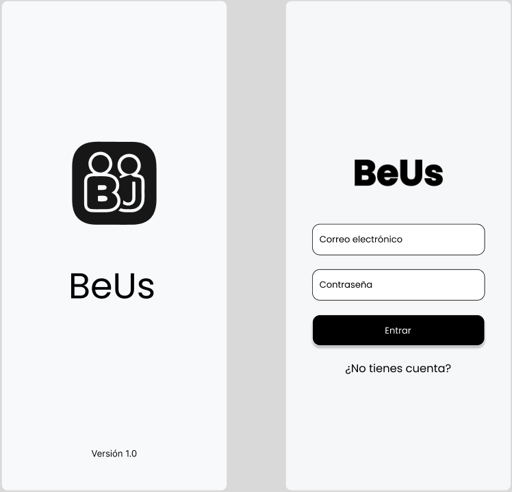
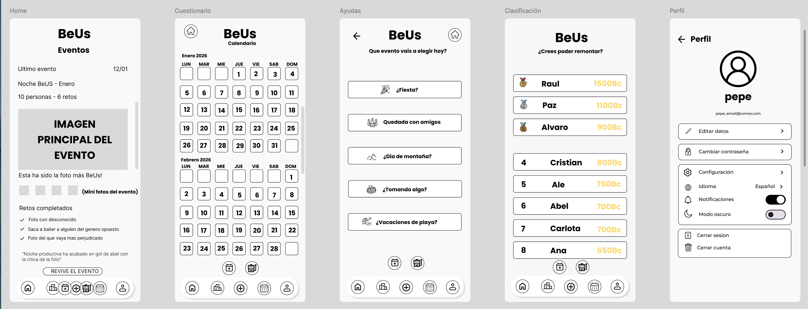

  

  
  
  
  
  

# BeUs - Tus recuerdos. Tu gente. Sin postureo.

Hoy en día nuestros recuerdos acaban perdidos entre miles de fotos en el móvil y chats eternos que nadie vuelve a abrir; necesitábamos una forma divertida y privada de revivirlos juntos, reírnos del pasado y crear nuevos momentos sin que intervenga todo Internet.

## Authors

- [@apaz-dev](https://www.github.com/apaz-dev)
- [@alvarobueno2112](https://www.github.com/alvarobueno2112)
- [@rauljaro06](https://www.github.com/rauljaro06)

## Modo Claro

 

## ModoOscuro

 

## Color Reference

| Color       | Hex                                                                |
|-------------| ------------------------------------------------------------------ |
| Gris claro  |  #F7F9FB |
| Negro       |  #000000 |
| Blanco      |  #FFFFFF |
| Gris oscuro |  #D9D9D9 |
| Amarillo    |  #FFD764 |

## Contributing

Las contribuciones siempre son bienvenidas!!!

1. Crea un branch con un nombre descriptivo (por ejemplo `feature/nombre` o `fix/descripcion`)
2. Abre un Pull Request hacia la rama destino (ej. `develop` o `main`) con una descripción clara de los cambios
3. Incluye screenshots o pasos para reproducir si el cambio afecta la UI
4. Asegúrate de que los nuevos menús y diálogos sigan las pautas de originales

## Roadmap

- [ ] Next Step 
