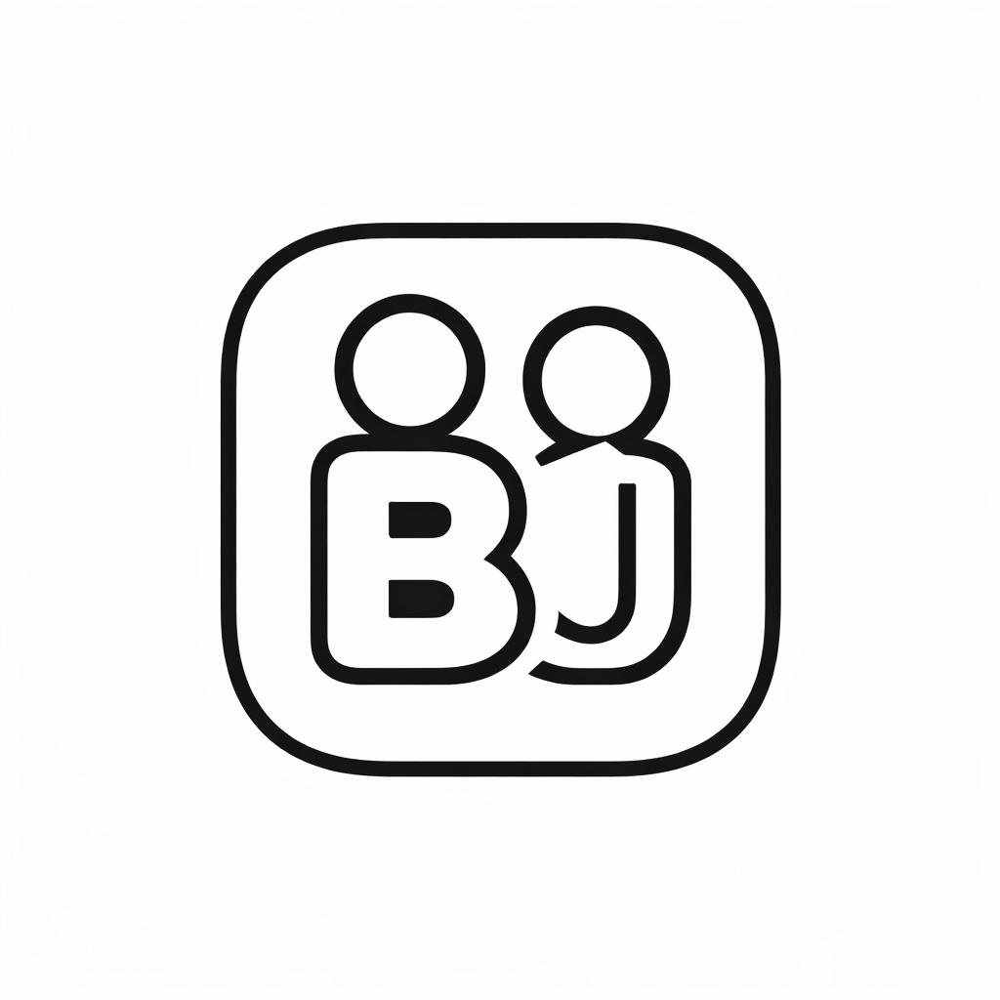
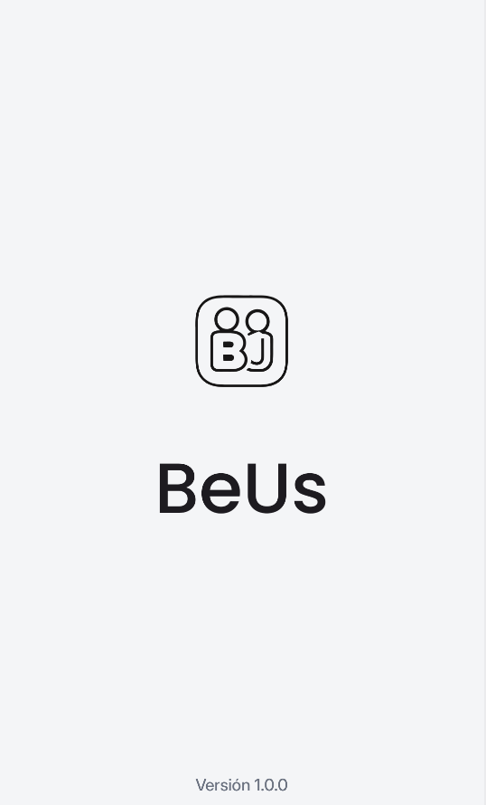
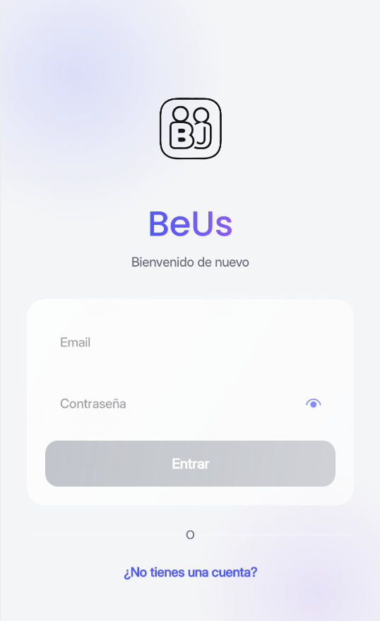
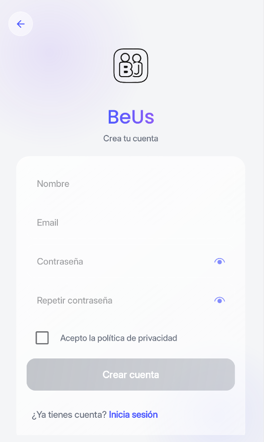
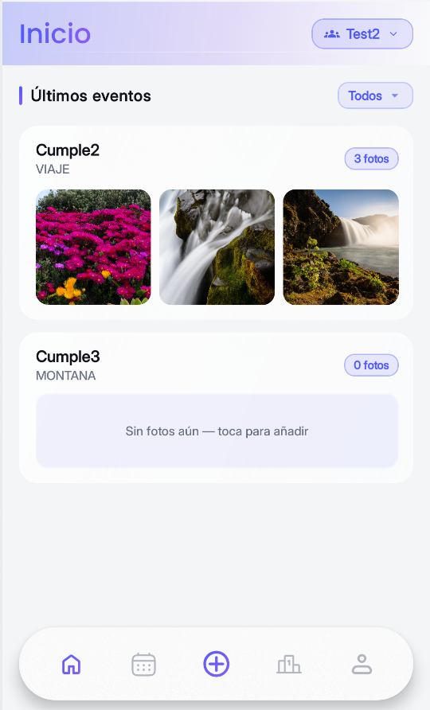
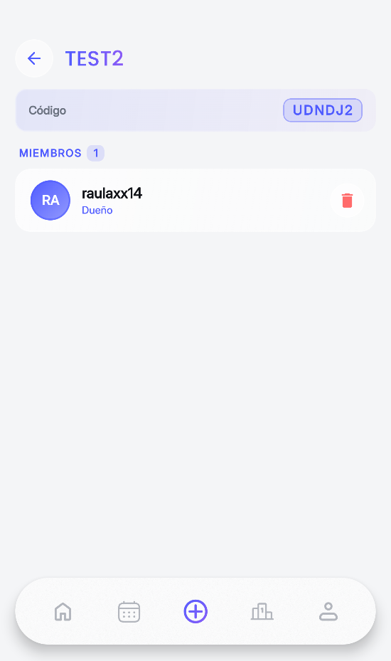
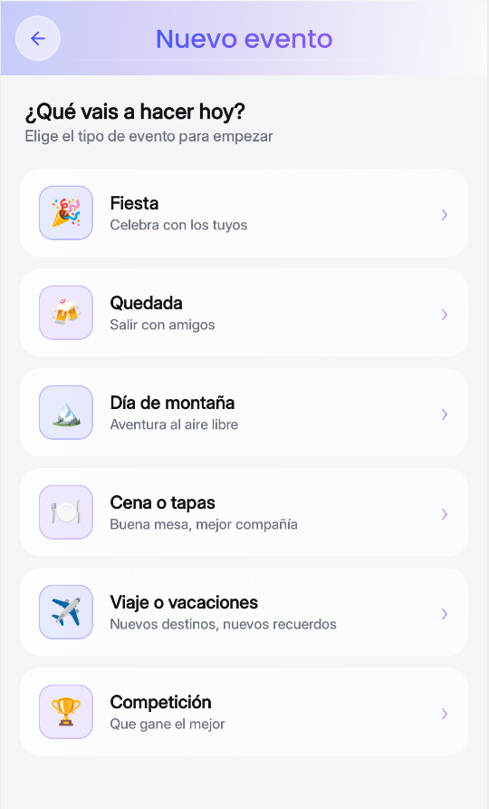
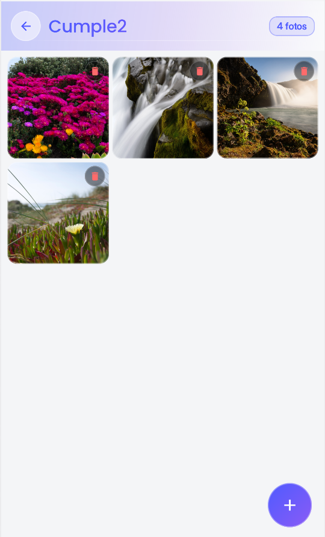
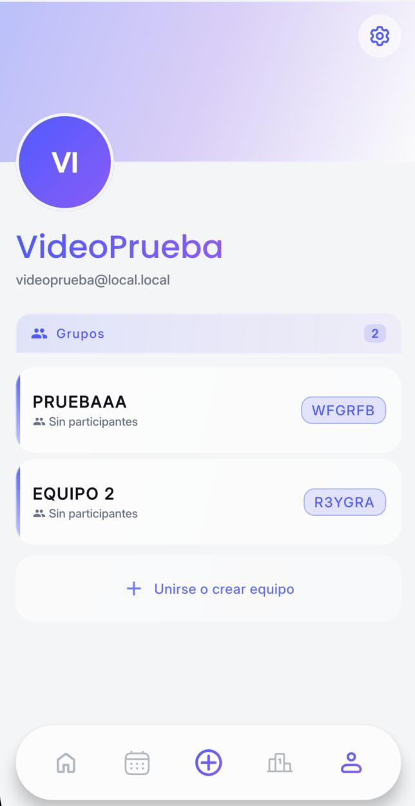
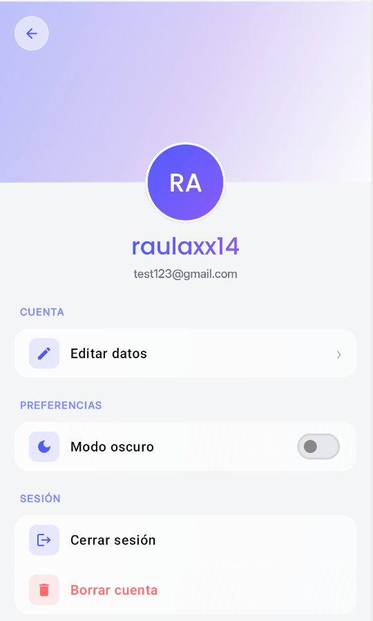

  

  
  
  
  
  

# BeUs - Tus recuerdos. Tu gente. Sin postureo.

Hoy en día nuestros recuerdos acaban perdidos entre miles de fotos en el móvil y chats eternos que nadie vuelve a abrir; necesitábamos una forma divertida y privada de revivirlos juntos, reírnos del pasado y crear nuevos momentos sin que intervenga todo Internet.

## Authors

- [@apaz-dev](https://www.github.com/apaz-dev)
- [@alvarobueno2112](https://www.github.com/alvarobueno2112)
- [@rauljaro06](https://www.github.com/rauljaro06)

---

## 📱 Pantallas

### 🔐 Autenticación

| Splash | Login | Registro |
|:---:|:---:|:---:|
|  |  |  |

### 🏠 Principal

| Home | Team Detail | Añadir Evento |
|:---:|:---:|:---:|
|  |  |  |

### 📷 Galería & Perfil

| Galería de Fotos |                       Perfil                       | Configuración |
|:---:|:--------------------------------------------------:|:---:|
|  |  |  |

---

## 🚀 Funcionalidades

| Pantalla | Descripción |
|---|---|
| **Splash** | Pantalla de carga inicial con animación |
| **Login / Signup** | Autenticación con email y contraseña |
| **Home** | Feed principal con tus grupos y actividad reciente |
| **Teams** | Creación y gestión de grupos privados |
| **Team Detail** | Vista detallada de un grupo con sus eventos |
| **Events** | Eventos dentro de cada grupo |
| **Photo Gallery** | Galería de fotos compartidas por evento |
| **Calendar** | Calendario con los próximos eventos del grupo |
| **Rank** | Ranking de actividad entre los miembros |
| **Bet** | Sistema de apuestas internas entre amigos |
| **Profile** | Perfil de usuario con avatar y datos |
| **Configuration** | Ajustes de la app, incluyendo modo oscuro |

---

## 🧭 Navegación

La app usa una **barra de navegación flotante** con efecto glass (Haze) y un **menú flotante de acción rápida** para añadir equipos, eventos y apuestas.

---

## 🌞 Color Reference (Modo Claro / Light)

| Color | Hex |
|---|---|
| background (BackgroundColor / ColorWhite) |  `#F4F5F7` |
| surface (cardColor) |  `#FFFFFF` |
| onSurface (textPrimary / ColorBlack) |  `#111318` |
| onSurfaceVariant (textSecondary) |  `#6B7280` |
| outline |  `#D1D5DB` |
| outlineVariant |  `#E5E7EB` |
| surfaceVariant |  `#E5E7EB` |
| primary |  `#111318` |
| onPrimary |  `#FFFFFF` |
| accentColor |  `#4F5BFF` |
| accentColor2 |  `#8B5CF6` |
| glassBase |  `#FFFFFF` |
| borderGlass *(33% alpha)* |  `#55FFFFFF` |

---

## 🌚 Color Reference (Modo Oscuro / Dark)

| Color | Hex |
|---|---|
| background (BackgroundColor / ColorWhite) |  `#0F1117` |
| surface (cardColor) |  `#1C1E26` |
| onSurface (textPrimary / ColorBlack) |  `#F0F0F0` |
| onSurfaceVariant (textSecondary) |  `#9CA3AF` |
| outline |  `#374151` |
| outlineVariant |  `#374151` |
| surfaceVariant |  `#2C2F3A` |
| primary |  `#E5E7EB` |
| onPrimary |  `#111318` |
| accentColor |  `#7C8BFF` |
| accentColor2 |  `#B06EFF` |
| glassBase |  `#1C1E26` |
| borderGlass *(27% alpha)* |  `#44FFFFFF` |

---

## 🛠️ Tech Stack

- **Kotlin Multiplatform** (Android + iOS)
- **Jetpack Compose / Compose Multiplatform**
- **Firebase** (Auth, Storage)
- **Supabase** (Base de datos)
- **FastAPI** (Backend Python)
- **Haze** (Efectos blur/glass en la navegación)

---

## Contributing

Las contribuciones siempre son bienvenidas!!!

1. Crea un branch con un nombre descriptivo (por ejemplo `feature/nombre` o `fix/descripcion`)
2. Abre un Pull Request hacia la rama destino (ej. `develop` o `main`) con una descripción clara de los cambios
3. Incluye screenshots o pasos para reproducir si el cambio afecta la UI
4. Asegúrate de que los nuevos menús y diálogos sigan las pautas originales

---
